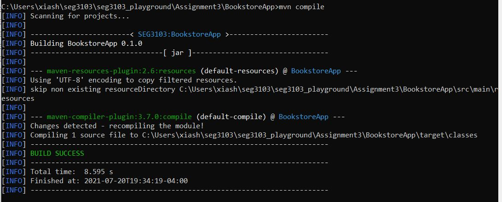

# SEG3103 Assignment 3

| Information | Value |
| --- | --- |
| Course | SEG 3103 |
| Semester | Summer 2021 |
| Professor | Andrew Forward |
| TA | Zahra Kakavand |
| Student 1 | Cynthia Sheng (30091655) |
| Student 2 | Iris Ji (300061354) |

### mvn version
download Maven and install by the instruction at https://maven.apache.org/install.html. Here is the Maven version:
```bash
mvn --version
```


### mvn compile
```bash
mvn compile
```


### mvn package -DskipTests
Then compile all of the tests without running them:
```bash
mvn package -DskipTests
```


It packages all project files into one jar file: BookstoreApp-0.1.0.jar:


### java -jar ./target/BookstoreApp-0.1.0.jar
```bash
java -jar ./target/BookstoreApp-0.1.0.jar
```


http://localhost:8080 didn't work:


Then, after referring to ..\seg3103_playground\Assignment3\BookstoreApp\src\main\java\main\App.java, it used a different jar file:
```bash
ProcessBuilder pb = new ProcessBuilder("java", "-jar", "bookstore5.jar");
```


So, used 
```bash
java -jar bookstore5.jar
```


Now it worked:


### mvn test

```bash
mvn test
```


