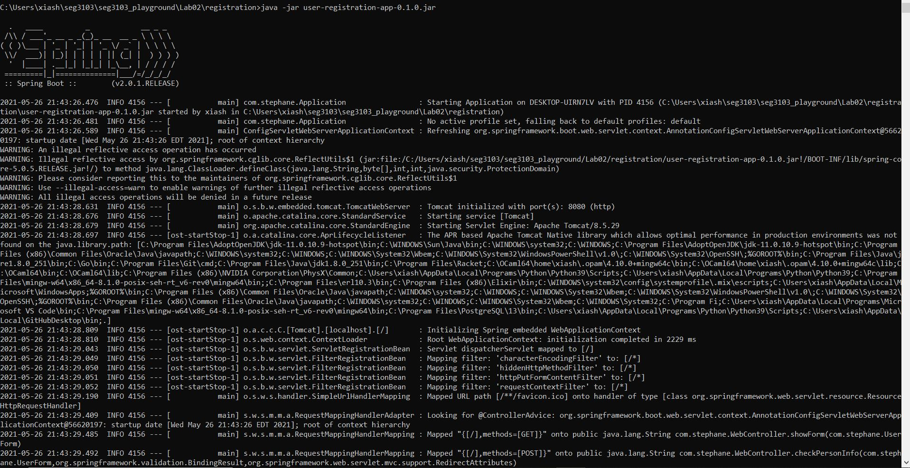
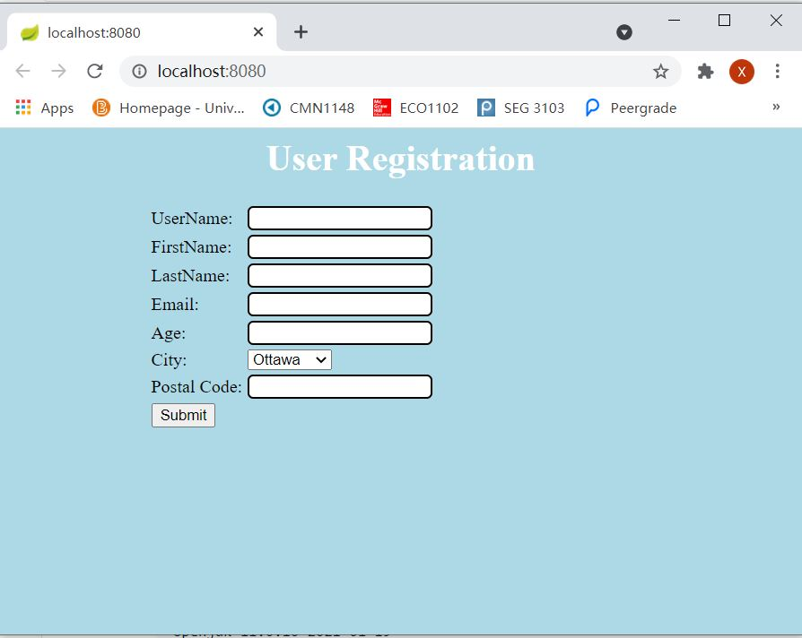
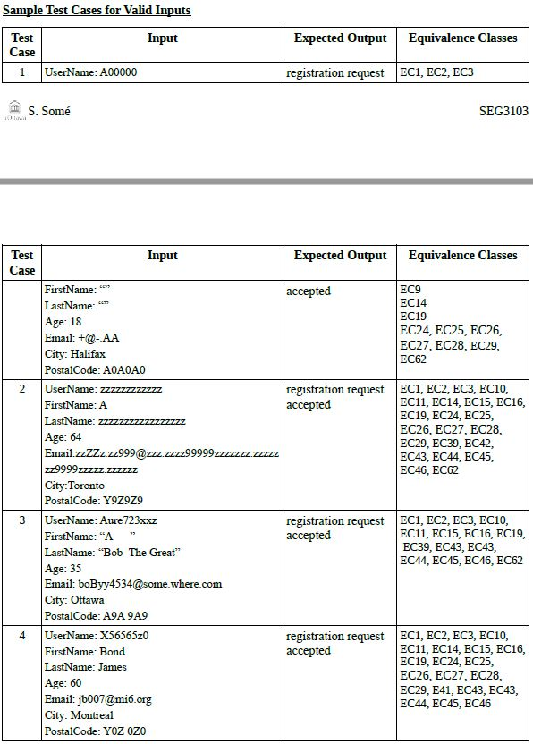
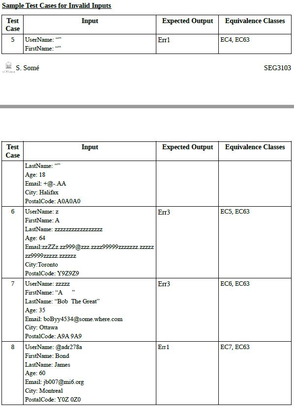

# SEG3103 Laboratory 2

| Information | Value |
| --- | --- |
| Course | SEG 3103 |
| Semester | Summer 2021 |
| Professor | Andrew Forward |
| TA | Henry Chen |
| Student 1 | Cynthia Sheng (30091655) |
| Student 2 | Iris Ji (300061354) |

This is the second laboratory for the course SEG3103.

I am running Java openjdk 11

```bash
C:\Users\xiash>java --version
openjdk 11.0.10 2021-01-19
OpenJDK Runtime Environment AdoptOpenJDK (build 11.0.10+9)
OpenJDK 64-Bit Server VM AdoptOpenJDK (build 11.0.10+9, mixed mode)
```

I am running jar file 'user-registration-app-0.1.0.jar' (in `registration`):

```bash
java -jar  user-registration-app-0.1.0.jar
```



## Exercise 1:
I used the test cases given in the tutorial:




Here is the results:

Test Case |  Expected Results             | Actual Results                   | Verdict(Pass, Fail, Inconclusive)
----------|-------------------------------|----------------------------------|----------------------------------
1         | registration request accepted | registration request accepted    | Pass
2         | registration request accepted | registration request accepted    | Pass
3         | registration request accepted | registration request accepted    | Pass
4         | registration request accepted | registration request accepted    | Pass
5         | Err1                          | Err1 and Err3                    | Fail
6         | Err3                          | Err1 and Err3  and Err6          | Fail
7         | Err3                          | Err3                             | Pass
8         | Err1                          | Err1                             | Pass


