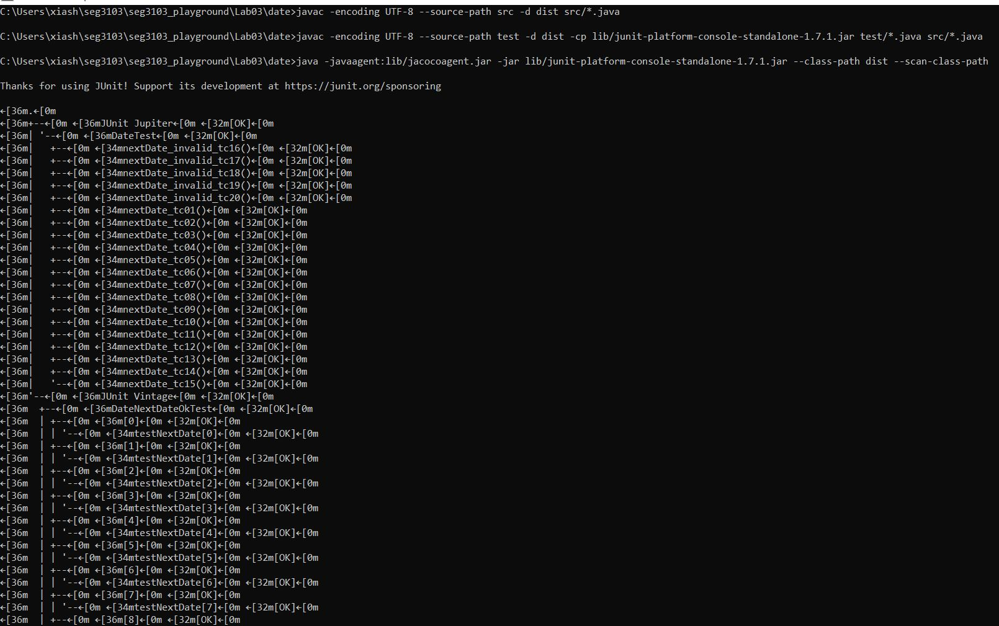
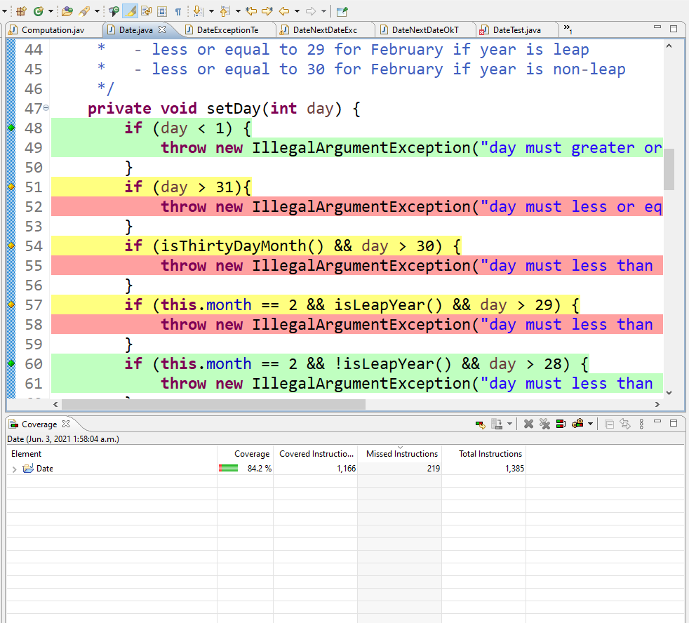
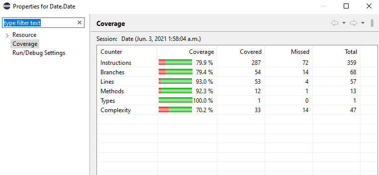

# SEG3103 Laboratory 3

| Information | Value |
| --- | --- |
| Course | SEG 3103 |
| Semester | Summer 2021 |
| Professor | Andrew Forward |
| TA | Nazanin Bayati |
| Student 1 | Cynthia Sheng (30091655) |
| Student 2 | Iris Ji (300061354) |

## Report
### Environment equipment

To use Jacoco, we need to fix the version of eclipse from JRE to JDK, so I downloaded JDK for Jacoco.

Then made the right configurations.

Finally, run the code given us.

This is all the environment preparation we made.

### Exercise
To compile the application:     
      
          javac -encoding UTF-8 --source-path src -d dist src/*.java

To compile the tests

    javac -encoding UTF-8 --source-path test -d dist -cp lib/junit-platform-console-standalone-1.7.1.jar test/*.java src/*.java

To run the agent

    java -javaagent:lib/jacocoagent.jar -jar lib/junit-platform-console-standalone-1.7.1.jar --class-path dist --scan-class-path
 
 
 

before adding any tests, I ran the Jcoco for the tests that were given, and I got the following results

To generate a report

    java -jar lib/jacococli.jar report jacoco.exec --classfiles dist --sourcefiles src --html report

To open the report
    
      ./report/index.html

report for date.java class is this: 

       
   
Here is the coverage before efforts to get 100% X coverage:
 

According to the report of Date.java, we add more test cases (from above missed branches) to increase coverage:
1) added September for ThirtyDayMonth().
2) added century divisible by 400 for isLeapYear().
3) added February test for isEndOfMonth().
4) added testcases for equals(object).
5) added testcases for toString().
6) added testcases for setday(): >31, isThirtyDayMonth() && day > 30, leap year February >29, etc.

Here is the result:
 
 

To do the exercise, we import the Date file.\

You can see the percentage is 84.2 and Date class has the percentage of 79.9. Now we are going to fix code.

After trying to achieve 100% coverage, I fixed code many times, while it does not improved and achieve 71%. Thus, I think this case has been perfect and it is not possible to achieve 100%.
