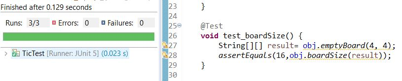

# SEG3103 Laboratory 4

| Information | Value |
| --- | --- |
| Course | SEG 3103 |
| Semester | Summer 2021 |
| Professor | Andrew Forward |
| TA | Nazanin Bayati |
| Student 1 | Xia (Cynthia) Sheng (300091655) |
| Student 2 | Iris Ji (300061354)) |


### Elixir

I am running Elixir 12.0 with Erlang 22

```bash
elixir --version
```


To run the Elixir program (in `fizzbuzz` and `tic`), first I compile it

```bash
mix compile
```

Then I run it

```bash
iex -S mix
```

Here is an output of the running program with a screenshot from the terminal


### ExUnit

ExUnit is built directly into Elixir (and compiled like above with `mix compile`)

To run the tests

```
mix test
```

Here is the output of the tests, with a screenshot from the terminal


## Test Driven Development

To compile:

    javac -encoding UTF-8 --source-path test -d dist -cp lib/junit-platform-console-standalone-1.7.1.jar test/*.java src/*.java

Then run the tests:

```
java -jar lib/junit-platform-console-standalone-1.7.1.jar --class-path dist --scan-class-path
```


### Commit 1 - test_defaultBoard():

function of default_Board() creates a 3x3 2D array with all elements are "_".

Make it fail first by using "0" instead of "_".


Then, change it to all "_" :


Here is the commit of 1st group:


### Commit 2 - test_defaultBoard():

Here is to test whether it fails when a 2x2 2D array with all elements are "_".


Then, change it back:


Here is the commit of 2nd group:


### Commit 3 - test_emptyBoard():

Here is to test if the shape of board is correct. 

First, Failed by let emptyBoard() create a 2x3 array and test with a 3x3 array:


Then, match both:


Here is the commit of 3nd group:


### Commit 4 - test_emptyBoard():

Each array should have the same size in board. If the board is not square, the test fails:


Then, change it back to the same size:


Here is the commit of 4th group:


### Commit 5 - test_boardSize():

let boardSize() expect 4 elements, and assert 3. Fail:


Now change to 4. Passed:


Here is the commit of 5th group:


### Commit 6 - test_boardSize():

This time use emptyBoard() to create a new board and test the size.

Expect 16 elements, and assert 13. Fail:


Now change to 16. Passed:


Here is the commit of 6th group:


### Commit 7 - test_boardPositions():

Test if it prevents input into slot that already had entry. Fail when an "X" tried to input into slot that had "O" already:


Now change to expected "N" for this situation. Passed:


Here is the commit of 7th group:


### Commit 8 - test_boardPositions():

This time, is it allow to have duplicate entry for the same slot. Here, test if it allow input "O" into the slot that had "O" already. Fail:


Now change to expected "N" for this situation. Passed:


Here is the commit of 8th group:


### Commit 9 - test_winner():

winner() showed true if player1 win.

First, Fail by assert 'false' when player1 win.


change to expected result:


Here is the commit of 9th group:


### Commit10 - test_winner():

winner() showed false if player2 win.

First, Fail by assert 'true' when player2 lose.


change to expected result:


Here is the commit of 10th group:


### Commit11 - Refactor:
Refactor index name into row, column. The test results are the same (all pass):


Here is the commit of 11th group:


