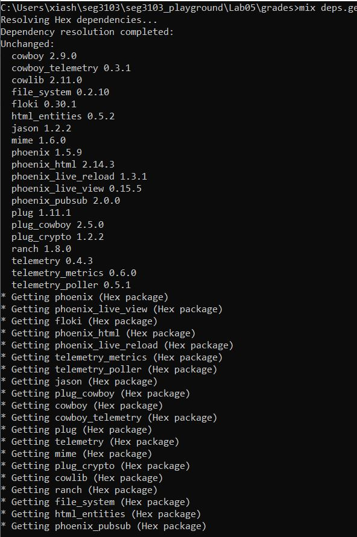
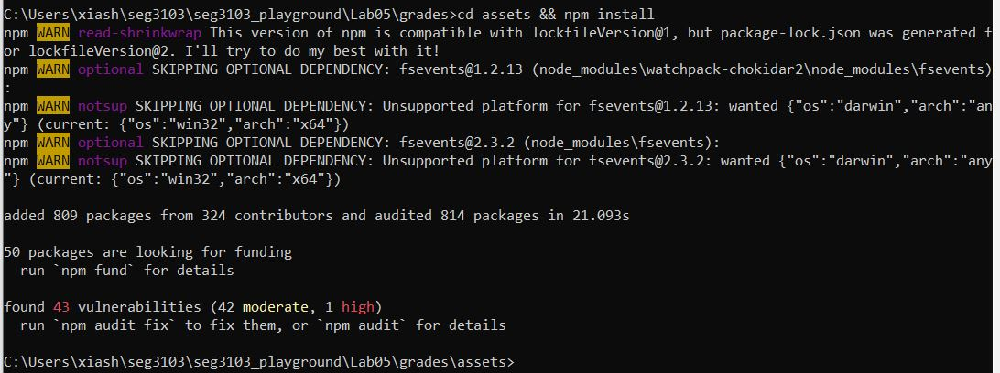

# SEG3103 Laboratory 5

| Information | Value |
| --- | --- |
| Course | SEG 3103 |
| Semester | Summer 2021 |
| Professor | Andrew Forward |
| TA | Henry Chen |
| Student 1 | Xia (Cynthia) Sheng (300091655) |
| Student 2 | Xinyu Ji (300061354)) |


### System

Windows 10

### setup
run the following code in grade folder:
```bash
mix deps.get
cd assets && npm install
```



Then we can run
```bash
mix phx.server
```
and login http://localhost:4000/ for lab05 part 1.

### Stub
