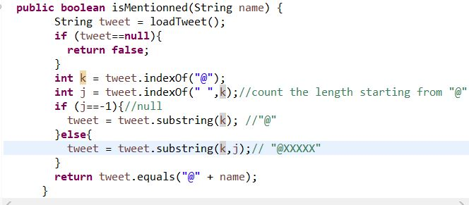

# SEG3103 Laboratory 5

| Information | Value |
| --- | --- |
| Course | SEG 3103 |
| Semester | Summer 2021 |
| Professor | Andrew Forward |
| TA | Henry Chen |
| Student 1 | Xia (Cynthia) Sheng (300091655) |
| Student 2 | Xinyu Ji (300061354)) |


### System

Windows 10

### setup
run the following code in grade folder:
```bash
mix deps.get
cd assets && npm install
```


Then we can run
```bash
mix phx.server
```
and login http://localhost:4000/:


### Stub
There is an error occurred when open http://localhost:4000/ and the button did't work. CMD showed that "function Grades.Calculator.letter_grade/1 is undefined (module Grades.Calculator is not available)". After checking page_live.ex, the module name should be Grades.Calculator. Then, according to TA, adding random number for each function to see if it works:


And it works now:


Then, replace the code with assignment2. Run again. Here is Arithmatic error occured (complain module page_live.ex at 3rd parameter of function handle_event - socket)


According to page_live.ex, the socket read input of tuples, so the function avg does not work (also shown in CMD: "State: %{components: {%{}, %{}, 1}, join_ref: "4", serializer: Phoenix.Socket.V2.JSONSerializer, socket: #Phoenix.LiveView.Socket<assigns: %{flash: %{}, grades: %{final: nil, homework: [], labs: [], midterm: nil}, ...")


### Mocks
Use the code of mock_partial_object() to implement the 4 missing test cases in TwitterTest.java. Run the test without any change in Twitter.java. 
```bash
java --add-opens java.base/java.lang=ALL-UNNAMED -jar lib/junit-platform-console-standalone-1.7.1.jar -cp dist;lib/easymock-4.3.jar;lib/objenesis-3.2.jar --scan-class-path
```
Here is the result:


According to the error message, the error occurred in isMentionned_dontReturnSubstringMatches(), " expected: <false> but was: <true>".  This is because  "meat" contains "me", so no matter if the loadTweet return @meat or @me. isMentionned("me") will always be true. Therefore, we need to change the code of isMentioned() in Twitter.java to ensure string after "@" should 100% match. We use equal() instead of contain():

  
run again, it works:

 

  

