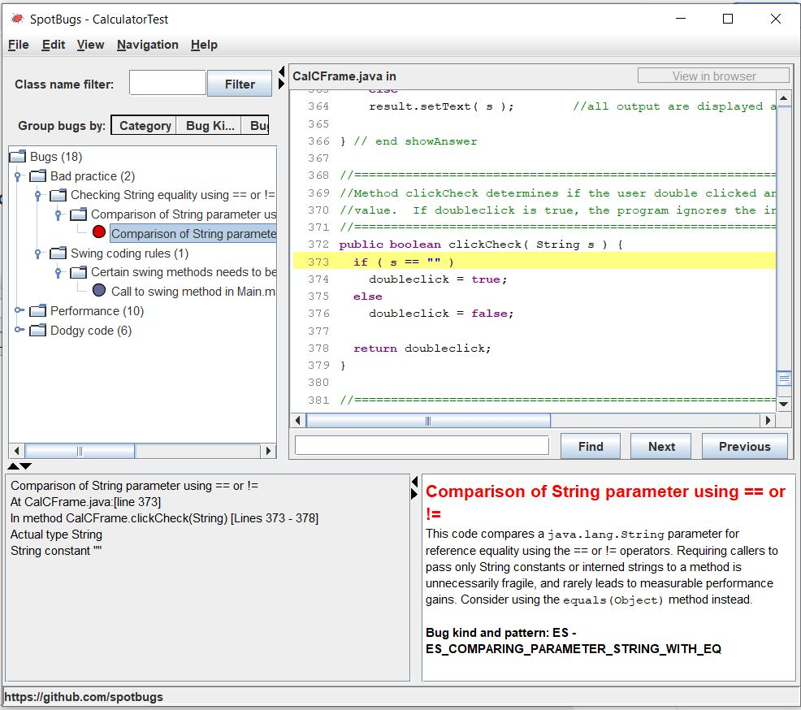
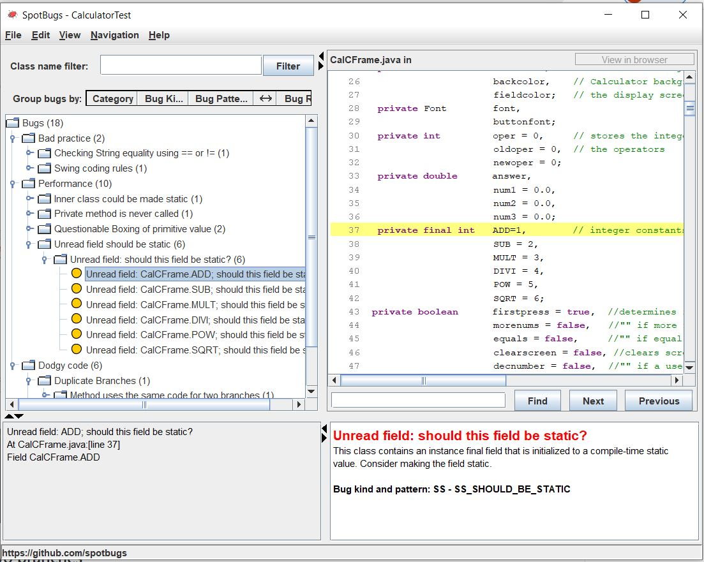

# SEG3103 Laboratory 7

| Information | Value |
| --- | --- |
| Course | SEG 3103 |
| Semester | Summer 2021 |
| Professor | Andrew Forward |
| TA | Henry Chen |
| Student 1 | Cynthia Sheng (30091655) |
| Student 2 | Iris Ji (300061354) |


### System

Windows 10

## Compile and run

Compiled the program by 
```bash
javac -encoding UTF-8 --source-path test -d dist -cp lib/junit-platform-console-standalone-1.7.1.jar test/*.java src/*.java
```


then ran with 
```bash
java -cp ./dist Main
```


Then we run
```bash
java -jar ./lib/spotbugs/lib/spotbugs.jar 
```

to start SpotBugs


We see there are total 18 bugs in the program:


### Bug 1: Comparison of String parameter using == or !=

Here is the bug:


Should use equals() method for String:


### Bug 2: Certain swing methods needs to be invoked in Swing thread

Here is the bug:


Swing method isVisible() is not thread-safe in Java, so it might cause deadlock or some threading issues.

### Bug 3: Could be refactored into a named static inner class

Here is the bug:


We know CalCFrame class is the outer here. So we can create a new inner class in CalCframe like inner class. Then we can call inner.WindowClose(WindowEvent e) in outer class, of course make it in a static innner class. So we can pass the WindowEvent as argument and don't need to create a new WindowAdapter to make the class to large. 

### Bug 4: Private method is never called

Here is the bug:


Since the code is never called, and it is not a test at all, so I just delete it.


### Bug 5 and 6: Boxing/unboxing to parse a primitive

Here are the Bug 5 and Bug 6, they have the same Bug issue:


We just need to change the code to XXX.parseXXX method


### Bug 7 to Bug 12: Unread field: should this field be static?

Bug 7 to Bug 12 have the same bug issue:


We just need to make them to static value.


### Bug 13: Method uses the same code for two branches

Here is the bug:


Since all the condition have will lead to the same result, we just need to remove the "else".


Here we delete all the if,else if and else because this bug is linked to bug 15-17.

### Bug 14: Switch statement found where default case is missing

Here is the bug:


We know it just miss a default statement, so we just need to add one.


### Bug 15-17: Condition has no effect


Bug 15 to Bug 17 have the same bug issue:


We know the reason is all the condition has the same result, so the condition has no meaning, we can delete all of them


### Bug 18: Condition has no effect(2)

Here is the bug:


We just need to delete the code because they did nothing(same result as the previous code)


### Check again
As expected, all bugs that we fixed no longer showed up in the analysis. There are only 2 bugs - bug 2 and bug 3 - remain, since we didn't fix them. 


